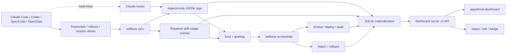
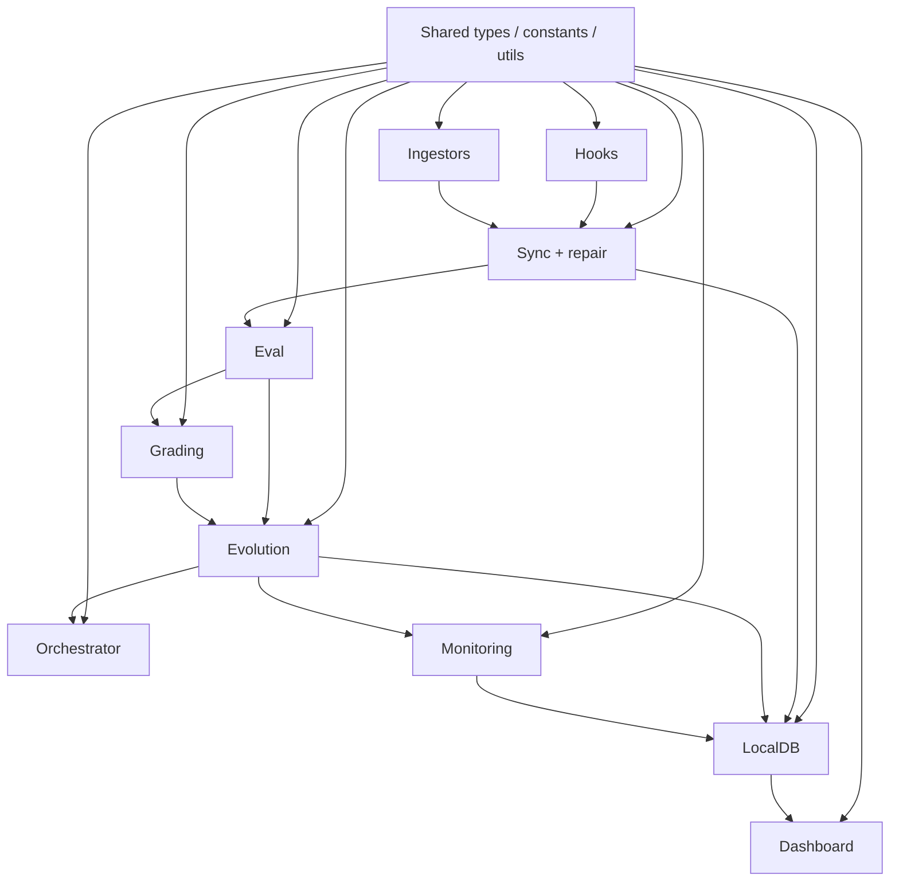
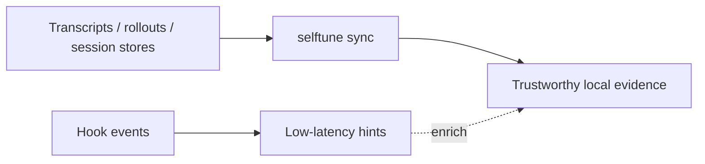
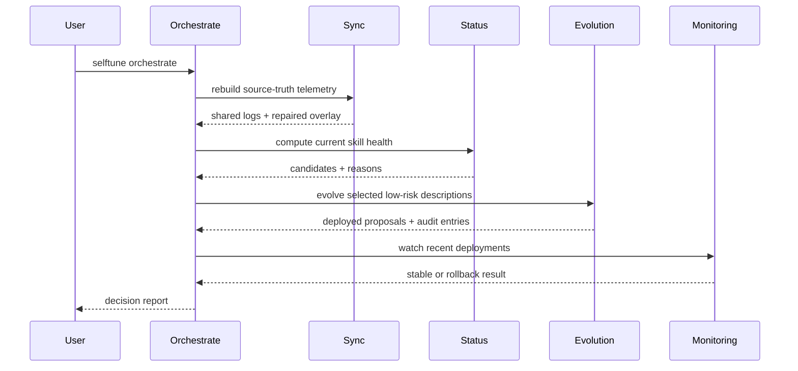

<!-- Verified: 2026-03-15 -->

# Architecture — selftune

selftune is a local-first feedback loop for AI agent skills. It turns saved agent activity into trustworthy local evidence, uses that evidence to improve low-risk skill behavior, and exposes the result through CLI surfaces and a local dashboard SPA.

## Agent-First Design Principle

selftune is a **skill consumed by AI agents**, not a CLI tool for humans. The user installs the skill (`npx skills add selftune-dev/selftune`), then interacts through their coding agent ("set up selftune", "improve my skills"). The agent reads `skill/SKILL.md` to discover commands, routes to the correct workflow doc, and executes CLI commands on the user's behalf.

This means:
- `skill/SKILL.md` is the primary product surface (agent reads this to know what to do)
- `skill/Workflows/*.md` are the agent's step-by-step guides
- `cli/selftune/` is the agent's API (the CLI binary the agent calls)
- Error messages and output should be machine-parseable (JSON) and guide the agent to the next action

If you are new to the repo, read these in order:

1. [docs/design-docs/system-overview.md](docs/design-docs/system-overview.md)
2. [PRD.md](PRD.md)
3. This file

## Architecture At A Glance



## Operating Rules

- **Source-truth first.** Transcripts, rollouts, and session stores are authoritative. Hooks are low-latency hints.
- **Shared local evidence.** Downstream modules communicate through shared JSONL logs, repaired overlays, audit logs, and SQLite materialization.
- **Autonomy with safeguards.** Low-risk description evolution can deploy automatically, but validation, watch, and rollback remain mandatory.
- **Local-first product surfaces.** `status`, `last`, and the dashboard read from local evidence, not external services.
- **Generic scheduling first.** `selftune schedule --install` is the main automation path. `selftune cron` is an OpenClaw-specific adapter.

## Domain Map

| Domain | Directory / File | Responsibility | Quality Grade |
|--------|-------------------|----------------|---------------|
| Bootstrap | `cli/selftune/init.ts` | Agent detection, config bootstrap, setup guidance | B |
| Telemetry | `cli/selftune/hooks/` | Claude hook-based prompt, session, and skill-use hints | B |
| Ingestors | `cli/selftune/ingestors/` | Normalize Claude, Codex, OpenCode, and OpenClaw data into shared logs | B |
| Source Sync | `cli/selftune/sync.ts`, `cli/selftune/repair/` | Rebuild source-truth local evidence and repaired overlays | B |
| Scheduling | `cli/selftune/schedule.ts` | Generic cron/launchd/systemd artifact generation and install | B |
| Cron Adapter | `cli/selftune/cron/` | Optional OpenClaw cron integration | B |
| Eval | `cli/selftune/eval/` | False-negative detection, eval generation, baseline, unit tests, composability | B |
| Grading | `cli/selftune/grading/` | Three-tier session grading with deterministic pre-gates and agent-based evaluation | B |
| Evolution | `cli/selftune/evolution/` | Propose, validate, deploy, audit, and rollback skill changes | B |
| Orchestrator | `cli/selftune/orchestrate.ts` | Autonomy-first sync -> candidate selection -> evolve -> watch loop | B |
| Monitoring | `cli/selftune/monitoring/` | Post-deploy regression detection and rollback triggers | B |
| Local DB | `cli/selftune/localdb/` | SQLite materialization and payload-oriented queries | B |
| Dashboard | `cli/selftune/dashboard.ts`, `cli/selftune/dashboard-server.ts`, `apps/local-dashboard/` | Local SPA shell, v2 API, overview/report/status UI | B |
| Observability CLI | `cli/selftune/status.ts`, `cli/selftune/last.ts`, `cli/selftune/badge/` | Fast local readouts of health, recent activity, and badge state | B |
| Contribute | `cli/selftune/contribute/` | Opt-in anonymized export for community signal pooling | C |
| Skill | `skill/` | Agent-facing routing table, workflows, and references | B |

## Dependency Direction

Dependencies are intended to flow forward through the pipeline:



Important practical interpretation:

- Hooks should not import grading or evolution code.
- The dashboard should consume payload-oriented queries, not rebuild business logic itself.
- The orchestrator should coordinate existing modules, not duplicate evolution or monitoring logic.

## Two Operating Modes

selftune has two distinct operating modes with different execution models:

### Interactive Mode (agent-driven)

The user talks to their coding agent. The agent reads `skill/SKILL.md`, routes
to the correct workflow, and runs CLI commands. The agent is the operator.

```
User: "improve my skills"
  → Agent reads SKILL.md → routes to Orchestrate workflow
  → Agent runs: selftune orchestrate
  → Agent summarizes results to user
```

### Automated Mode (OS-driven)

System scheduling (cron/launchd/systemd) calls the CLI binary directly.
No agent session needed, no token cost. Set up via `selftune cron setup`.

```
OS scheduler fires every 6 hours
  → selftune orchestrate --max-skills 3
  → sync → candidate selection → evolve → watch → write results to JSONL
  → Next interactive session sees improved SKILL.md
```

The agent is NOT in the loop for automated runs. This is intentional:
automated runs are routine maintenance (sync, low-risk evolutions) that
don't need agent intelligence or user interaction.

## Data Architecture

All data flows through append-only JSONL files. SQLite is a read-only
materialized view used only by the dashboard.

```
Source of Truth: JSONL files (~/.claude/*.jsonl)
├── telemetry.jsonl          Session telemetry records
├── skill-usage.jsonl        Skill trigger/miss records
├── queries.jsonl            User prompt log
├── evolution-audit.jsonl    Evolution decisions + evidence
├── orchestrate-runs.jsonl   Orchestrate run reports
└── canonical.jsonl          Normalized cross-platform records

Core Loop: reads JSONL directly
├── orchestrate.ts  → readJsonl(TELEMETRY_LOG)
├── evolve.ts       → readJsonl(EVOLUTION_AUDIT_LOG)
├── grade.ts        → readJsonl(TELEMETRY_LOG)
└── status.ts       → readJsonl(TELEMETRY_LOG + SKILL_LOG + QUERY_LOG)

Materialized View: SQLite (~/.selftune/selftune.db)
├── materialize.ts reads ALL JSONL → inserts into SQLite tables
└── dashboard-server.ts reads SQLite for fast API queries
```

The core loop (orchestrate, evolve, grade, status) reads JSONL directly.
SQLite is only used by the dashboard for fast queries over large datasets.
This design keeps the core loop simple (no database dependency) while giving
the dashboard fast aggregation.

## Repository Shape

```text
cli/selftune/
├── index.ts              CLI entry point
├── init.ts               Config bootstrap and environment detection
├── sync.ts               Source-truth sync orchestration
├── orchestrate.ts        Main autonomous loop
├── schedule.ts           Generic scheduler install/preview
├── dashboard.ts          Dashboard command entry point
├── dashboard-server.ts   Bun.serve API + SPA shell
├── dashboard-contract.ts Shared overview/report/run-report payload types
├── constants.ts          Paths and log file constants
├── types.ts              Shared TypeScript interfaces
├── utils/                JSONL, transcript, logging, schema, agent-call helpers
├── hooks/                Claude-specific hints, activation, enforcement
├── ingestors/            Claude/Codex/OpenCode/OpenClaw adapters
├── repair/               Rebuild repaired skill-usage overlay
├── eval/                 False-negative detection and eval generation
├── grading/              Session grading
├── evolution/            Propose / validate / deploy / rollback
├── monitoring/           Post-deploy watch and rollback
├── localdb/              SQLite schema, materialization, queries
├── contribute/           Opt-in anonymized export
├── cron/                 OpenClaw scheduler adapter
├── memory/               Evolution memory persistence
└── workflows/            Multi-skill workflow discovery and persistence

apps/local-dashboard/
├── src/pages/            Overview, per-skill report, and system status routes
├── src/components/       Dashboard components
├── src/hooks/            Data-fetch hooks against the v2 API
└── src/types.ts          Frontend types from dashboard-contract.ts

skill/
├── SKILL.md              Agent-facing routing table
├── Workflows/            Workflow docs for each command
└── references/           Logs, grading, and taxonomy references
```

## Module Definitions

| Module | Files | Responsibility | May Import From |
|--------|-------|----------------|-----------------|
| Shared | `types.ts`, `constants.ts`, `utils/*.ts` | Core shared types, paths, JSONL helpers, transcript parsing, agent-call helpers | Bun built-ins only |
| Bootstrap | `init.ts`, `observability.ts` | Config bootstrap and health checks | Shared |
| Hooks | `hooks/*.ts` | Claude-specific hints, activation rules, and enforcement guards | Shared |
| Ingestors | `ingestors/*.ts` | Normalize platform-specific session sources | Shared |
| Source Sync | `sync.ts`, `repair/*.ts` | Produce trustworthy local evidence before downstream decisions | Shared, Ingestors |
| Scheduling | `schedule.ts` | Build and optionally install generic scheduling artifacts | Shared |
| Cron Adapter | `cron/*.ts` | OpenClaw-specific scheduling setup/list/remove | Shared |
| Eval | `eval/*.ts` | Build eval sets, detect false negatives, baseline and composability analysis | Shared |
| Grading | `grading/*.ts` | Session grading and pre-gates | Shared, Eval |
| Evolution | `evolution/*.ts` | Description/body/routing proposal, validation, deploy, rollback, audit | Shared, Eval, Grading |
| Orchestrator | `orchestrate.ts` | Coordinate sync, candidate selection, evolve, and watch | Shared, Sync, Evolution, Monitoring, Status |
| Monitoring | `monitoring/*.ts` | Watch deployed changes and trigger rollback | Shared, Evolution |
| Local DB | `localdb/*.ts` | Materialize logs and audits into overview/report/query shapes | Shared, Sync outputs, Evolution audit |
| Dashboard | `dashboard.ts`, `dashboard-server.ts`, `apps/local-dashboard/` | Serve and render the local dashboard experience | Shared, LocalDB, Status, Observability, Evolution (evidence) |
| Skill | `skill/` | Provide agent-facing command routing and workflow guidance | Reads public CLI behavior and references |

## Truth Model: Hooks vs. Source Systems



Why this matters:

- Hooks can be missing, polluted, or agent-specific.
- Source sync is how selftune stays cross-agent and backfillable.
- Autonomous changes should be justified from the synced evidence path, not from hooks alone.

## Autonomous Loop



Current policy:

- Low-risk description evolution is autonomous by default.
- `--review-required` is an opt-in stricter policy mode.
- Validation, watch, and rollback are the main safety system.

## Config System

`selftune init` writes `~/.selftune/config.json`.

| Field | Type | Description |
|-------|------|-------------|
| `agent_type` | `claude_code \| codex \| opencode \| openclaw \| unknown` | Detected host agent |
| `cli_path` | `string` | Absolute path to the selftune CLI entry point |
| `llm_mode` | `agent \| api` | How grading/evolution run model calls |
| `agent_cli` | `string \| null` | Preferred agent binary |
| `hooks_installed` | `boolean` | Whether Claude hooks are configured |
| `initialized_at` | `string` | ISO timestamp of the last bootstrap |

## Shared Local Artifacts

| Artifact | Writer | Reader |
|----------|--------|--------|
| `~/.claude/session_telemetry_log.jsonl` | Hooks, ingestors, sync | Eval, grading, status, localdb |
| `~/.claude/skill_usage_log.jsonl` | Hooks | Eval, repair, status |
| `~/.claude/skill_usage_repaired.jsonl` | Sync / repair | Eval, status, localdb |
| `~/.claude/all_queries_log.jsonl` | Hooks, ingestors, sync | Eval, status, localdb |
| `~/.claude/evolution_audit_log.jsonl` | Evolution | Monitoring, status, localdb |
| `~/.claude/orchestrate_runs.jsonl` | Orchestrator | LocalDB, dashboard |
| `~/.selftune/*.sqlite` | LocalDB materializer | Dashboard server |

## The Evaluation Model

| Tier | What It Checks | Automated |
|------|----------------|-----------|
| Tier 1 — Trigger | Did the skill fire when it should have? | Yes |
| Tier 2 — Process | Did the session follow the expected workflow? | Yes |
| Tier 3 — Quality | Was the resulting work actually good enough? | Yes, via agent-as-grader |

## Invocation Taxonomy

| Type | Description |
|------|-------------|
| Explicit | The user names the skill directly |
| Implicit | The task matches the skill without naming it |
| Contextual | The task is implicit with real-world domain noise |
| Negative | Nearby queries that should not trigger the skill |

## Current Known Tensions

- Candidate selection is improving, but still needs stronger real-world evidence gating.
- Local and cloud dashboard semantics should converge on the same payload contracts.
- The CLI core still avoids runtime dependencies, while the local SPA intentionally uses frontend build-time dependencies.
- OpenClaw cron remains supported, but it is no longer the primary automation story.

## Related Docs

- [docs/design-docs/system-overview.md](docs/design-docs/system-overview.md)
- [docs/integration-guide.md](docs/integration-guide.md)
- [docs/design-docs/evolution-pipeline.md](docs/design-docs/evolution-pipeline.md)
- [docs/design-docs/monitoring-pipeline.md](docs/design-docs/monitoring-pipeline.md)
