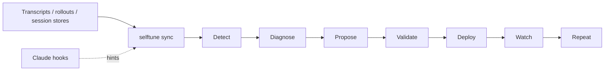

# selftune — Product Requirements Document

**Status:** Current
**Version:** 0.2.1
**Date:** 2026-03-15
**Owner:** WellDunDun

---

## Problem

Agent skills are static. Users are not.

When you ship a Claude Code skill, you write a description, do a few manual tests, and hope it triggers when real users need it. There is no feedback loop. There is no signal. You don't know whether the skill is firing, under-firing, or missing entire categories of user intent — until someone complains, or gives up and starts typing explicit instructions like "use the pptx skill."

That moment — when a user has to be explicit because the agent didn't follow directions on its own — is a failure. It's also invisible. The session completes, the task gets done, and nothing records that the skill missed. The frustration accumulates silently. Users conclude AI doesn't follow directions. The real cause — a description that doesn't match how real people talk — goes undiagnosed and unfixed.

This problem compounds as skill libraries grow. More skills means more surface area for triggering conflicts, context dilution, and implicit/explicit mismatches. The tools for managing this don't exist yet.

**selftune is the feedback loop that closes this gap.** It observes real sessions, detects missed triggers, grades execution quality, and evolves skill descriptions toward the language real users actually use — automatically, across Claude Code, Codex, and OpenCode.

---

## Vision

Skills that get better on their own.

A developer ships a skill once. selftune watches how it performs in real usage, finds the queries it missed, proposes a better description, validates the change against real signal, deploys low-risk improvements automatically, and keeps watching for regressions. Over time, the skill converges on the description that actually matches how users talk — without the developer babysitting every routine fix.

---

## Target Users

**Primary: Skill authors**  
Developers writing and maintaining Claude Code skills, whether for personal use, their team, or the public ecosystem. They feel the pain of undertriggering most acutely and have the most to gain from a closed feedback loop.

**Secondary: Agent power users**  
Developers using Claude Code, Codex, or OpenCode daily who build personal skill libraries. They don't necessarily write skills professionally but accumulate them and notice when they stop working.

**Tertiary: Developer tooling teams**  
Teams building on top of agent infrastructure who need observability into skill performance as part of their platform. They care about aggregate signal and want programmatic access.

---

## Core Insight

The industry has optimised for writing skills. Nobody has optimised for knowing whether they work.

Every other tool in this space — skill-creator, reins, skillforge, skilllens — operates at authoring time. selftune operates at runtime. It sits one layer downstream, watching what actually happens when real users interact with real skills in real sessions.

This is a fundamentally different product category: **skill observability and continuous improvement**, not skill scaffolding.

---

## The Feedback Loop

```
Observe → Detect → Diagnose → Propose → Validate → Deploy → Watch → Repeat
```



**Observe** — selftune reads the transcripts and telemetry your agent already saves. Claude hooks add low-latency local hints, but source-truth sync is authoritative. Telemetry lands in shared local logs and repaired overlays.

**Detect** — Cross-reference all queries against actual skill triggers. Queries that should have triggered a skill but didn't are false negatives. These are the invisible failures.

**Diagnose** — Grade sessions against expectations: did the skill read SKILL.md before starting work? Was the right tool used? Did the output match the expected format? Were there errors or thrashing?

**Propose** — Generate a new skill description that would have caught the missed queries. Use the real query corpus — not synthetic prompts — as ground truth.

**Validate** — Run the proposed description against the full eval set before shipping anything. Confirm the pass rate improves and no regressions are introduced.

**Deploy** — Write the improved SKILL.md back to disk with a full audit trail. Low-risk description changes can deploy autonomously; higher-touch workflows can still sit behind stricter policy or PR review.

**Watch** — Monitor the next N sessions to confirm the improvement held. Flag if performance degrades after a deploy and roll back automatically when confidence is strong enough.

**Repeat** — The loop runs continuously in the background. Skills that converge don't need attention. Skills that keep missing get escalated.

---

## Three-Tier Evaluation Model

selftune evaluates skill performance across three tiers, each more meaningful than the last:

**Tier 1 — Trigger detection**  
Did the skill fire at all? Compares the universe of user queries against logged skill triggers to find false negatives. Powered by source-truth transcripts/rollouts plus repaired overlays, not synthetic test prompts.

**Tier 2 — Process validation**  
Given that the skill fired, did it follow the right steps? Was SKILL.md read before starting? Were commands run in the right order? Was there excessive retrying or error recovery?

**Tier 3 — Quality grading**  
Was the output actually good? Did the pptx have real slide titles, not placeholder text? Did the docx have the right structure? This tier uses the agent itself as the grader — no separate API key required.

Most eval tools stop at tier 1 or, at best, synthetic tier 2. selftune runs all three tiers on real session data.

---

## Invocation Taxonomy

selftune classifies every trigger query into one of four types, drawn from eval best practices:

| Type | Description | Example |
|---|---|---|
| **Explicit** | Names the skill directly | "use the pptx skill to make slides" |
| **Implicit** | Describes the task without naming the skill | "make me a slide deck" |
| **Contextual** | Implicit with realistic domain noise | "I need slides for the Q3 board meeting next Tuesday" |
| **Negative** | Adjacent queries that should NOT trigger | "what format should I use for a presentation?" |

A healthy skill catches all three positive types. A skill that only catches explicit invocations is forcing users to babysit it. selftune surfaces this breakdown so skill authors know exactly what kind of improvement is needed.

---

## Multi-Tool Architecture

selftune works across the three major agent platforms without requiring any of them specifically:

**Claude Code** — Stop, PostToolUse, and UserPromptSubmit hooks write low-latency local telemetry automatically. The authoritative path is still transcript replay / `sync`, which retroactively backfills and repairs usage from `~/.claude/projects/` without waiting for new sessions.

**Codex** — Two modes: a wrapper (`codex-wrapper.ts`) that tees the `codex exec --json` JSONL stream in real time, and a batch ingestor (`codex-rollout.ts`) for retroactive ingestion of the rollout files Codex auto-writes to `$CODEX_HOME/sessions/`.

**OpenCode** — Reads directly from OpenCode's SQLite database at `~/.local/share/opencode/opencode.db`, with fallback support for legacy JSON session files.

**OpenClaw** — Imports agent session history and supports an optional OpenClaw-specific cron adapter. Generic scheduling plus `selftune orchestrate` is still the main autonomous runtime story.

All three adapters write to the same shared log schema. Everything downstream — eval generation, grading, evolution — is tool-agnostic.

---

## Key Features

### Session Telemetry
Captures per-session process metrics across all three platforms: tool call counts by type, bash commands executed, skills triggered, error count, assistant turns, token usage. Written to `~/.claude/session_telemetry_log.jsonl`.

### False Negative Detection
Compares the universe of logged queries against actual skill trigger events. Surfaces the queries where a skill should have fired but didn't. These are the invisible failures that accumulate into user frustration.

### Eval Set Generation
Converts repaired/source-truth usage logs into trigger eval sets: positives (real queries that triggered), negatives (real queries that didn't), annotated with invocation type. Feeds directly into existing skill-creator eval infrastructure.

### Session Grading
Grades completed sessions against expectations using the agent the user already has installed — Claude Code, Codex, or OpenCode — without requiring a separate Anthropic API key. Produces `grading.json` compatible with the skill-creator eval viewer. Includes deterministic pre-gates that resolve expectations without LLM calls (<20ms), and graduated 0-1 scoring for finer-grained confidence tracking. Rich failure feedback provides structured explanations (`query`, `failure_reason`, `improvement_hint`, `invocation_type`) that feed directly into the evolution pipeline.

### Skill Evolution

Runs the description improvement loop using real usage signal as ground truth. Proposes new descriptions, validates against the eval set, confirms the pass rate improves, and writes the result to disk with a full audit trail. Supports Pareto multi-candidate evolution: generates N candidates in parallel, computes a Pareto frontier across invocation type dimensions (explicit, implicit, contextual, negative), and optionally merges complementary proposals. CLI flags: `--pareto` (default true), `--candidates N` (default 3, max 5).

### Grader Skill
A `skill-eval-grader` skill that makes the grader a first-class agent capability. Users can say "grade my last pptx session" and the agent reads telemetry, parses the transcript, grades inline, and writes `grading.json` — using their existing subscription, no extra setup.

### Process Stats
Aggregate telemetry across all sessions for a skill: average turns, tool call breakdown, error rates, bash command patterns. Useful for catching efficiency regressions and diagnosing thrashing.

### Skill Health Summary (`selftune status`)
Concise CLI overview of all skill health at a glance. Shows per-skill pass rates, trend direction (up/down/stable), missed query counts, status badges (HEALTHY/REGRESSED/NO DATA), unmatched queries total, pending evolution proposals, and system health from `doctor`. Runs in <500ms with zero LLM calls. Reuses `computeMonitoringSnapshot` from the monitoring pipeline.

### Last Session Insight (`selftune last`)
Quick post-session diagnostic showing the most recent session's triggered skills, unmatched queries, error count, tool call count, and a contextual recommendation. Designed for rapid feedback after a session ends. Zero LLM calls.

### Skill Health Dashboard (`selftune dashboard`)
Local React SPA served by `dashboard-server.ts`, backed by SQLite materialization and payload-oriented v2 API routes. Primary view is an overview page showing skill health, trends, unmatched queries, recent orchestrate activity, and pending proposals. Drill-down routes provide per-skill reports with pass-rate history, missed queries, evidence, and evolution context.

### Retroactive Replay (`selftune ingest claude`)
Batch ingestor for existing Claude Code session transcripts. Scans `~/.claude/projects/<hash>/<session-id>.jsonl`, extracts user queries and session metrics, and populates the shared JSONL logs. Idempotent via marker file — safe to run repeatedly. Supports `--since` date filtering, `--dry-run` preview, `--force` re-ingestion, and `--verbose` output. Bootstraps the eval corpus from existing sessions without waiting for hooks to accumulate data.

### Community Contribution (`selftune contribute`)
Opt-in export of anonymized skill observability data for community signal pooling. Assembles a `ContributionBundle` containing sanitized positive queries, eval entries with invocation taxonomy, grading summaries, evolution summaries, and session metrics. Two sanitization levels: conservative (paths, emails, secrets, IPs) and aggressive (adds identifiers, quoted strings, module names, 200-char truncation). Supports `--preview` to inspect before exporting, and `--submit` to create a GitHub issue with the bundle.

---

## Non-Goals (initial scope)

- **No skill marketplace integration.** selftune improves skills you already have; it doesn't discover or distribute new ones.
- **No multi-user / team telemetry aggregation.** Logs are local per-developer. Team aggregation is a future consideration.
- **No hosted cloud dependency for the core loop.** The core product must stay useful from local logs, local SQLite materialization, and a local dashboard.
- **No model fine-tuning.** selftune improves skill descriptions, not model weights.
- **No support for tools outside Claude Code, Codex, OpenCode, and OpenClaw.** Gemini CLI, Cursor, Cline, and others are future work.

---

## Success Metrics

**Adoption**
- Time to first false-negative detection: target < 10 minutes from install
- Time to first trustworthy local sync: target < 10 minutes from install

**Effectiveness**
- Trigger pass rate improvement after one evolution loop: target > 15 percentage points
- False negative detection rate: surface at least one missed trigger per 20 sessions for any undertriggering skill
- Autonomous low-risk deploys maintain or improve watch metrics with automatic rollback when they regress

**Retention**
- Skills with selftune installed show measurably lower explicit-invocation rates over 30 days
- Users run the orchestrated loop at least once per skill per month

---

## Relationship to reins

reins and selftune are complementary tools at different points in the agent development lifecycle:

| | reins | selftune |
|---|---|---|
| **When** | Repo setup, periodic audits | Continuously, every session |
| **What** | Scaffold, score, evolve repo structure | Observe, grade, evolve skill descriptions |
| **Output** | AGENTS.md, ARCHITECTURE.md, maturity score | Telemetry logs, grading reports, improved SKILL.md |
| **Signal** | Static analysis of repo structure | Live signal from real user sessions |

Use reins to build the repo that makes agents effective. Use selftune to know whether the skills in that repo are actually working — and to make them better automatically.

---

## Release History

| npm Version | Date | Feature Milestones Included |
|-------------|------|-----------------------------|
| **0.1.0** | 2026-02-28 | M1 through M5 (observe, grade, evolve, watch, restructure) |
| **0.1.4** | 2026-03-01 | M6 and M7 (three-layer observability, replay + contribute) |
| **0.2.0** | 2026-03-05 | M8, M8.5 (sandbox harness, eval improvements, agents, guardrails, dashboard server) |
| **0.2.1** | 2026-03-10 | Source-truth sync hardening, SQLite-backed dashboard SPA, autonomy-first scheduling/orchestration |

---

## Feature Milestones

> **Note:** These are feature phases used during development planning. They do not correspond to npm version numbers. See the Release History table above for the mapping.

### M1 — Observe and detect
- Claude Code hooks (Stop, PostToolUse, UserPromptSubmit)
- Codex adapter (wrapper + rollout ingestor)
- OpenCode adapter (SQLite reader)
- Shared log schema
- False negative detection (`hooks-to-evals.ts`)
- Invocation taxonomy annotation
- Process telemetry stats

### M2 — Grade
- Session grader via agent subprocess (no API key required)
- `skill-eval-grader` skill
- `grading.json` output compatible with skill-creator eval viewer
- `grade-session.ts --use-agent` with auto-detection

### M3 — Evolve (Complete)
- Description improvement loop wired to real usage signal
- Validation against eval set before deploy
- PR generation with diff and eval summary
- Confidence threshold and stopping criteria

### M4 — Watch (Complete)
- Post-deploy monitoring
- Regression detection
- Escalation when performance degrades after a deploy

### M5 — Agent-First Skill Restructure (Complete)
- `init` command: auto-detect agent environment, write persistent config to `~/.selftune/config.json`
- Skill decomposed from 370-line monolith into Reins-style routing table (~120 lines)
- 8 workflow files (1 per command) with step-by-step agent guides
- 2 reference docs (grading methodology, invocation taxonomy) extracted from skill
- Config-based CLI path resolution (no hardcoded paths in workflows)
- Doctor command enhanced with config health check

### M6 — Three-Layer Observability (Complete)
- `selftune status`: CLI skill health summary with pass rates, trends, and system health
- `selftune last`: Quick insight from the most recent session
- Redesigned `selftune dashboard`: SQLite-backed SPA with overview and per-skill drill-down routes
- Dashboard data schema expanded with `computed` field (snapshots, unmatched, pending proposals)
- Shared pure functions (`computeMonitoringSnapshot`, `getLastDeployedProposal`) reused across all three surfaces
- Three observability surfaces replace activity-metric-only dashboard with actionable skill health data

### M7 — Retroactive Replay & Community Contribution (Complete)
- `selftune ingest claude`: batch ingest Claude Code transcripts from `~/.claude/projects/`
- Idempotent marker file prevents duplicate ingestion
- Extracts all user queries per session (not just last), populates all three JSONL logs
- `selftune contribute`: opt-in anonymized data export as `ContributionBundle`
- Two sanitization levels: conservative (paths, emails, secrets, IPs) and aggressive (adds identifiers, strings, modules, truncation)
- GitHub submission via `gh issue create` (inline <50KB, gist >=50KB)
- Architecture lint rules for contribute module dependency isolation

### M8.5 — Advanced Eval Improvements (Complete)

Four high-value eval improvements implemented in parallel:

1. **Deterministic Pre-Gates** (`grading/pre-gates.ts`): 4 fast code checks (SKILL.md read, tools called, error count, session completed) that resolve grading expectations without LLM. Tagged `source: "pre-gate"`. Skips LLM entirely when all expectations resolve.
2. **Graduated Scoring**: All expectations carry a `score` (0.0-1.0) alongside binary `passed`. `GradingSummary` includes `mean_score` and `score_std_dev`. `buildGraduatedSummary()` computes aggregate stats.
3. **Rich Failure Feedback**: Structured `FailureFeedback` (`query`, `failure_reason`, `improvement_hint`, `invocation_type`) flows from grader → extract-patterns → propose-description, giving the evolution LLM specific context about what failed and why.
4. **Pareto Evolution** (`evolution/pareto.ts`): Multi-candidate proposals with Pareto frontier selection across invocation type dimensions. Complementary candidates can be merged. All Pareto functions are pure. CLI: `--pareto` (default true), `--candidates N` (default 3, max 5).

239 new tests added. Zero breaking changes (all new fields optional).

### M8 — Sandbox Test Harness & SDK Integration (v0.2.0)

**Problem:** selftune had 499 unit tests but zero end-to-end validation. CLI commands were never exercised against realistic data in an integrated way. LLM-dependent commands (grade, evolve) couldn't be tested without a live agent CLI.

**Solution:**
- **Layer 1 (Local Sandbox):** `tests/sandbox/run-sandbox.ts` — Exercises all 7 read-only CLI commands + 3 hooks against fixture data in an isolated `/tmp` directory. 10 tests, ~400ms.
- **Layer 2 (Devcontainer + Claude CLI):** `tests/sandbox/docker/` and `.devcontainer/` — Devcontainer setup and orchestrator for `grade`, `evolve`, and `watch` using `claude -p` (Agent SDK CLI) with `--dangerously-skip-permissions`.
- **Firewall Isolation:** `.devcontainer/init-firewall.sh` — Sandbox firewall based on official Claude Code devcontainer reference.
- **Fixtures:** 3 real skills from skills.sh (find-skills, frontend-design, ai-image-generation) with differentiated health profiles.

**Key Design Decisions:**
- HOME env var redirection for complete isolation (all paths use `homedir()`)
- Two-layer architecture: fast local tests (free) + Docker LLM tests (costs tokens)
- Devcontainer-based isolation with firewall, no API key needed

### M9 — Trustworthy Autonomy (1.0)
- Stronger candidate selection and evidence gating
- Durable orchestrate run reports and decision visibility
- End-to-end proof of autonomous deploy -> watch -> rollback
- Multi-skill conflict detection (two skills competing for the same query)
- Team mode: aggregate telemetry across developers, shared eval sets

---

## Open Questions

1. **Autonomy policy granularity.** Which changes stay autonomous by default, and which ones should still require stricter policy controls? Description changes are low-risk; full-body and routing changes are not.

2. **Diversity requirements for the training signal.** How many sessions, and how diverse across invocation types, before triggering an evolution loop? Too few sessions risks overfitting to one user's language.

3. **Multi-skill conflict resolution.** When two skills compete for the same query, how does selftune decide which should win? This is a description-level problem that may require a separate conflict detector.

4. **Cross-developer signal pooling.** Anonymous aggregate signal from multiple developers could dramatically improve evolution quality. What's the opt-in model and privacy story? *(Partially addressed in M7/0.1.4: `selftune contribute` exports anonymized bundles with two-tier sanitization. Submission is via GitHub issue. Aggregation and ingestion of contributed bundles is future work.)*

5. **Evaluation of the evaluator.** How do we know the grader is grading correctly? We need meta-evals: known-good and known-bad sessions with ground truth verdicts.

---

## Appendix: Log Schema

### `~/.claude/session_telemetry_log.jsonl`
One record per completed session. Fields: `timestamp`, `session_id`, `source` (claude_code / codex / opencode), `cwd`, `transcript_path`, `last_user_query`, `tool_calls`, `total_tool_calls`, `bash_commands`, `skills_triggered`, `assistant_turns`, `errors_encountered`, `transcript_chars`.

### `~/.claude/skill_usage_log.jsonl`
One record per skill trigger event. Fields: `timestamp`, `session_id`, `skill_name`, `skill_path`, `query`, `triggered`, `source`, plus optional provenance fields `skill_scope`, `skill_project_root`, `skill_registry_dir`, and `skill_path_resolution_source` when selftune can prove whether the skill came from a project-local, global, admin, or system registry or explain why scope remains unknown.

### `~/.claude/all_queries_log.jsonl`
One record per user query. Fields: `timestamp`, `session_id`, `query`, `source`.

### `grading.json`
Output from the grader. Compatible with skill-creator eval viewer schema. Fields: `session_id`, `skill_name`, `transcript_path`, `graded_at`, `expectations` (each with `score` 0-1 and `source` tag), `summary` (with `mean_score`, `score_std_dev`), `execution_metrics`, `claims`, `eval_feedback`, `failure_feedback`.
