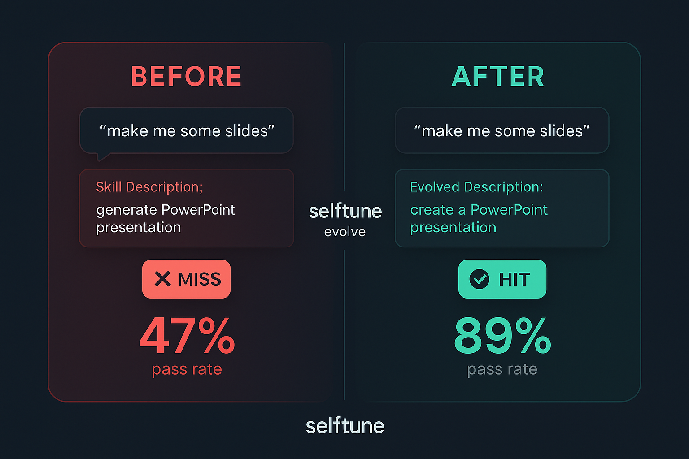
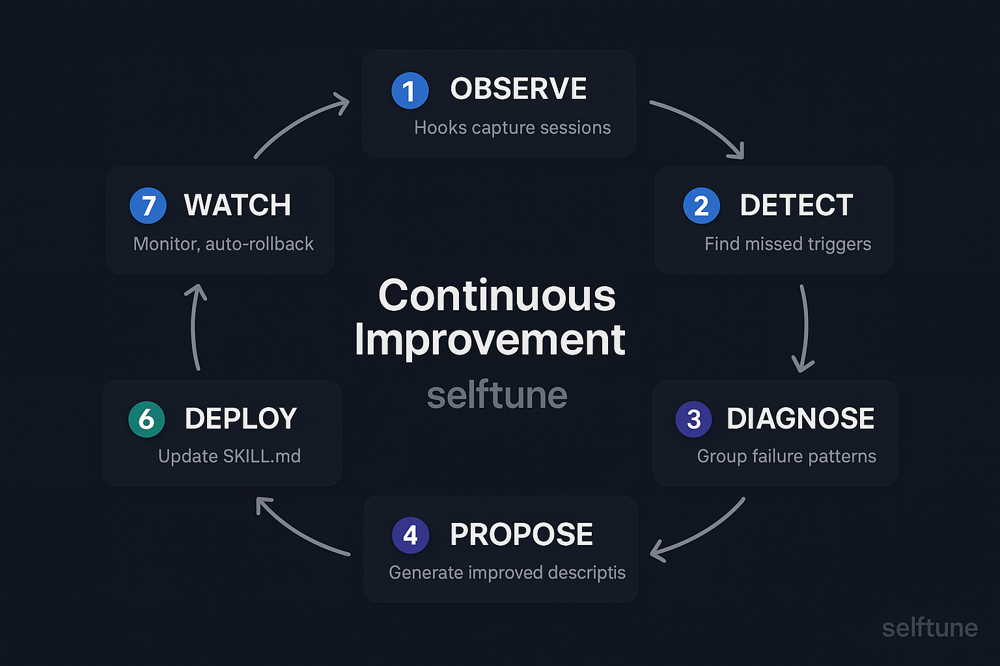

<div align="center">


<br/>

[](https://github.com/WellDunDun/selftune)

<br/>


[](https://github.com/WellDunDun/selftune/actions/workflows/ci.yml)
[](https://www.npmjs.com/package/selftune)
[](LICENSE)
[](https://www.npmjs.com/package/selftune?activeTab=dependencies)

**[Install](#install)** · **[Before / After](#before--after)** · **[Commands](#commands)** · **[Platforms](#platform-quick-start)** · **[Docs](docs/integration-guide.md)**

</div>

---

> [!NOTE]
> **Phase 0 — Foundation.** OpenClaw ingestor shipped, case studies in progress. [Show HN launch targeting March 17.](https://github.com/WellDunDun/selftune)

A user says "make me a slide deck" and your pptx skill doesn't fire. No error. No log. You never find out.

Skill descriptions are written based on what developers *think* users will say, not what they *actually* say. selftune observes real sessions, finds the mismatches, and rewrites your skill descriptions using evidence. Not vibes.

Works with **Claude Code**, **Codex**, **OpenCode**, and **OpenClaw**. Zero runtime dependencies.

## Install

```bash
npx skills add WellDunDun/selftune
```

Then tell your agent: **"initialize selftune"**

That's it. Within minutes you'll see which skills are undertriggering.

## Before / After

<p align="center">
  
</p>

selftune found that real users say "slides", "deck", "presentation for Monday" — none of which matched the original skill description. It rewrote the triggers. Validated against the eval set. Deployed with a backup. Done.

## What It Does

<p align="center">
  
</p>

- **Observe** — Hooks capture every session automatically
- **Detect** — Finds queries where your skill *should* have fired but didn't
- **Evolve** — Rewrites skill descriptions based on real failure patterns
- **Watch** — Monitors post-deploy, auto-rollbacks if anything regresses

## Commands

| Command | What it does |
|---|---|
| `selftune status` | Which skills are undertriggering and why |
| `selftune evals --skill <name>` | Generate eval sets from real usage |
| `selftune evolve --skill <name>` | Propose, validate, deploy improved descriptions |
| `selftune watch --skill <name>` | Monitor post-deploy, auto-rollback on regressions |
| `selftune dashboard` | Visual skill-health dashboard |
| `selftune replay` | Backfill from existing Claude Code transcripts |
| `selftune doctor` | Health check on logs, hooks, config |

Full command reference: `selftune --help`

## Why Not Just Rewrite Skills Manually?

| Approach | Problem |
|---|---|
| Rewrite the description yourself | No data on what users actually say. No validation. No regression detection. |
| Add "ALWAYS invoke when..." directives | Brittle. One agent rewrite away from breaking. |
| Force-load skills on every prompt | Doesn't fix the description. Expensive band-aid. |
| **selftune** | Measures real failures, proposes fixes, validates against eval sets, auto-rollbacks on regressions. |

## Platform Quick Start

**Claude Code** — Hooks install automatically. `selftune replay` backfills existing transcripts.

**Codex** — `selftune wrap-codex -- <args>` or `selftune ingest-codex`

**OpenCode** — `selftune ingest-opencode`

**OpenClaw** — `selftune ingest-openclaw` + `selftune cron setup` for autonomous evolution

Requires [Bun](https://bun.sh) or Node.js 18+. No extra API keys.

---

<div align="center">

[Architecture](ARCHITECTURE.md) · [Contributing](CONTRIBUTING.md) · [Security](SECURITY.md) · [Integration Guide](docs/integration-guide.md) · [Sponsor](https://github.com/sponsors/WellDunDun)

MIT License

</div>
