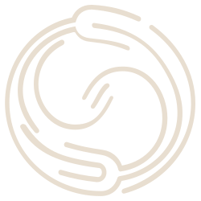
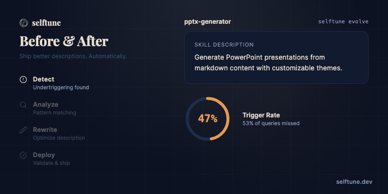
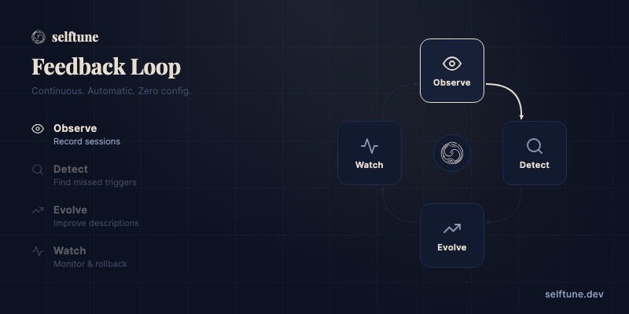

<div align="center">



# selftune

**Self-improving skills for AI agents.**

[](https://github.com/selftune-dev/selftune/actions/workflows/ci.yml)
[](https://github.com/selftune-dev/selftune/actions/workflows/codeql.yml)
[](https://securityscorecards.dev/viewer/?uri=github.com/selftune-dev/selftune)
[](https://www.npmjs.com/package/selftune)
[](LICENSE)
[](https://www.typescriptlang.org/)
[](https://www.npmjs.com/package/selftune?activeTab=dependencies)
[](https://bun.sh)

Your agent skills learn how you work. Detect what's broken. Fix it automatically.

**[Install](#install)** · **[Use Cases](#built-for-how-you-actually-work)** · **[How It Works](#how-it-works)** · **[Commands](#commands)** · **[Platforms](#platforms)** · **[Docs](docs/integration-guide.md)**

</div>

---

Your skills don't understand how you talk. You say "make me a slide deck" and nothing happens — no error, no log, no signal. selftune watches your real sessions, learns how you actually speak, and rewrites skill descriptions to match. Automatically.

Works with **Claude Code** (primary). Codex, OpenCode, and OpenClaw adapters are experimental. Zero runtime dependencies.

## Install

```bash
npx skills add selftune-dev/selftune
```

Then tell your agent: **"initialize selftune"**

Two minutes. No API keys. No external services. No configuration ceremony. Uses your existing agent subscription. You'll see which skills are undertriggering.

**CLI only** (no skill, just the CLI):

```bash
npx selftune@latest doctor
```

## Updating

The skill and CLI ship together as one npm package. To update:

```bash
npx skills add selftune-dev/selftune
```

This reinstalls the latest version of both the skill (SKILL.md, workflows) and the CLI. `selftune doctor` will warn you when a newer version is available.

## Before / After

<p align="center">
  
</p>

selftune learned that real users say "slides", "deck", "presentation for Monday" — none of which matched the original skill description. It rewrote the description to match how people actually talk. Validated against the eval set. Deployed with a backup. Done.

## Built for How You Actually Work

**I write and use my own skills** — Your skill descriptions don't match how you actually talk. Tell your agent "improve my skills" and selftune learns your language from real sessions, evolves descriptions to match, and validates before deploying. No manual tuning.

**I publish skills others install** — Your skill works for you, but every user talks differently. selftune ships skills that get better for every user automatically — adapting descriptions to how each person actually works.

**I manage an agent setup with many skills** — You have 15+ skills installed. Some work. Some don't. Some conflict. Tell your agent "how are my skills doing?" and selftune gives you a health dashboard and automatically improves the skills that aren't keeping up.

## How It Works

<p align="center">
  
</p>

A continuous feedback loop that makes your skills learn and adapt. Automatically. Your agent runs everything — you just install the skill and talk naturally.

**Observe** — Hooks capture every query and which skills fired. On Claude Code, hooks install automatically during `selftune init`. Backfill existing transcripts with `selftune ingest claude`.

**Detect** — Finds the gap between how you talk and how your skills are described. You say "make me a slide deck" and your pptx skill stays silent — selftune catches that mismatch. Real-time correction signals ("why didn't you use X?") are detected and trigger immediate improvement.

**Evolve** — Rewrites skill descriptions — and full skill bodies — to match how you actually work. Cheap-loop mode uses haiku for the loop, sonnet for the gate (~80% cost reduction). Teacher-student body evolution with 3-gate validation. Automatic backup.

**Watch** — After deploying changes, selftune monitors skill trigger rates. If anything regresses, it rolls back automatically.

**Automate** — Run `selftune cron setup` to install OS-level scheduling. selftune syncs, evaluates, evolves, and watches on a schedule — no manual intervention needed.

## What's New in v0.2.0

- **Full skill body evolution** — Beyond descriptions: evolve routing tables and entire skill bodies using teacher-student model with structural, trigger, and quality gates
- **Synthetic eval generation** — `selftune eval generate --synthetic` generates eval sets from SKILL.md via LLM, no session logs needed. Solves cold-start: new skills get evals immediately.
- **Cheap-loop evolution** — `selftune evolve --cheap-loop` uses haiku for proposal generation and validation, sonnet only for the final deployment gate. ~80% cost reduction.
- **Batch trigger validation** — Validation now batches 10 queries per LLM call instead of one-per-query. ~10x faster evolution loops.
- **Per-stage model control** — `--validation-model`, `--proposal-model`, and `--gate-model` flags give fine-grained control over which model runs each evolution stage.
- **Auto-activation system** — Hooks detect when selftune should run and suggest actions
- **Enforcement guardrails** — Blocks SKILL.md edits on monitored skills unless `selftune watch` has been run
- **Live dashboard server** — `selftune dashboard --serve` with SSE auto-refresh and action buttons
- **Evolution memory** — Persists context, plans, and decisions across context resets
- **4 specialized agents** — Diagnosis analyst, pattern analyst, evolution reviewer, integration guide
- **Sandbox test harness** — Comprehensive automated test coverage, including devcontainer-based LLM testing

## Commands

Your agent runs these — you just say what you want ("improve my skills", "show the dashboard").

| Group      | Command                                      | What it does                                                                                |
| ---------- | -------------------------------------------- | ------------------------------------------------------------------------------------------- |
|            | `selftune status`                            | See which skills are undertriggering and why                                                |
|            | `selftune orchestrate`                       | Run the full autonomous loop (sync → evolve → watch)                                        |
|            | `selftune dashboard`                         | Open the visual skill health dashboard                                                      |
|            | `selftune doctor`                            | Health check: logs, hooks, config, permissions                                              |
| **ingest** | `selftune ingest claude`                     | Backfill from Claude Code transcripts                                                       |
|            | `selftune ingest codex`                      | Import Codex rollout logs (experimental)                                                    |
| **grade**  | `selftune grade --skill <name>`              | Grade a skill session with evidence                                                         |
|            | `selftune grade baseline --skill <name>`     | Measure skill value vs no-skill baseline                                                    |
| **evolve** | `selftune evolve --skill <name>`             | Propose, validate, and deploy improved descriptions                                         |
|            | `selftune evolve body --skill <name>`        | Evolve full skill body or routing table                                                     |
|            | `selftune evolve rollback --skill <name>`    | Rollback a previous evolution                                                               |
| **eval**   | `selftune eval generate --skill <name>`      | Generate eval sets (`--synthetic` for cold-start)                                           |
|            | `selftune eval unit-test --skill <name>`     | Run or generate skill-level unit tests                                                      |
|            | `selftune eval composability --skill <name>` | Detect conflicts between co-occurring skills                                                |
|            | `selftune eval import`                       | Import external eval corpus from [SkillsBench](https://github.com/benchflow-ai/skillsbench) |
| **auto**   | `selftune cron setup`                        | Install OS-level scheduling (cron/launchd/systemd)                                          |
|            | `selftune watch --skill <name>`              | Monitor after deploy. Auto-rollback on regression.                                          |
| **other**  | `selftune telemetry`                         | Manage anonymous usage analytics (status, enable, disable)                                  |
|            | `selftune alpha upload`                      | Run a manual alpha upload cycle and emit a JSON send summary                                |

Full command reference: `selftune --help`

## Why Not Just Rewrite Skills Manually?

| Approach                               | Problem                                                                                                                          |
| -------------------------------------- | -------------------------------------------------------------------------------------------------------------------------------- |
| Rewrite the description yourself       | No data on how users actually talk. No validation. No regression detection.                                                      |
| Add "ALWAYS invoke when..." directives | Brittle. One agent rewrite away from breaking.                                                                                   |
| Force-load skills on every prompt      | Doesn't fix the description. Expensive band-aid.                                                                                 |
| **selftune**                           | Learns from real usage, rewrites descriptions to match how you work, validates against eval sets, auto-rollbacks on regressions. |

## Different Layer, Different Problem

LLM observability tools trace API calls. Infrastructure tools monitor servers. Neither knows whether the right skill fired for the right person. selftune does — and fixes it automatically.

selftune is complementary to these tools, not competitive. They trace what happens inside the LLM. selftune makes sure the right skill is called in the first place.

| Dimension    | selftune                                          | Langfuse             | LangSmith      | OpenLIT        |
| ------------ | ------------------------------------------------- | -------------------- | -------------- | -------------- |
| **Layer**    | Skill-specific                                    | LLM call             | Agent trace    | Infrastructure |
| **Detects**  | Missed triggers, false negatives, skill conflicts | Token usage, latency | Chain failures | System metrics |
| **Improves** | Descriptions, body, and routing automatically     | —                    | —              | —              |
| **Setup**    | Zero deps, zero API keys                          | Self-host or cloud   | Cloud required | Helm chart     |
| **Price**    | Free (MIT)                                        | Freemium             | Paid           | Free           |
| **Unique**   | Self-improving skills + auto-rollback             | Prompt management    | Evaluations    | Dashboards     |

## Platforms

**Claude Code** (fully supported) — Hooks install automatically. `selftune ingest claude` backfills existing transcripts. This is the primary supported platform.

**Codex** (experimental) — `selftune ingest wrap-codex -- <args>` or `selftune ingest codex`. Adapter exists but is not actively tested.

**OpenCode** (experimental) — `selftune ingest opencode`. Adapter exists but is not actively tested.

**OpenClaw** (experimental) — `selftune ingest openclaw` + `selftune cron setup` for autonomous evolution. Adapter exists but is not actively tested.

Requires [Bun](https://bun.sh) or Node.js 18+. No extra API keys.

---

<div align="center">

[Architecture](ARCHITECTURE.md) · [Contributing](CONTRIBUTING.md) · [Security](SECURITY.md) · [Integration Guide](docs/integration-guide.md) · [Sponsor](https://github.com/sponsors/WellDunDun)

MIT licensed. Free forever. Primary support for Claude Code; experimental adapters for Codex, OpenCode, and OpenClaw.

</div>
