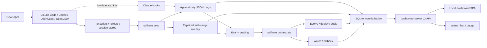
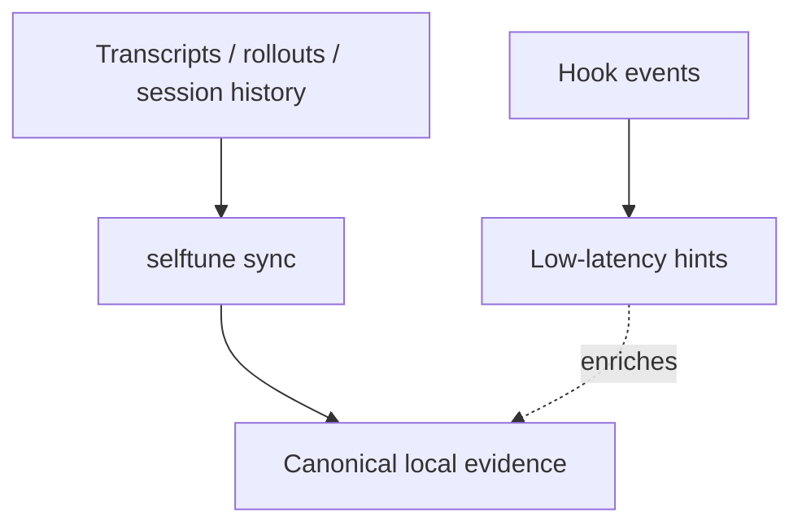
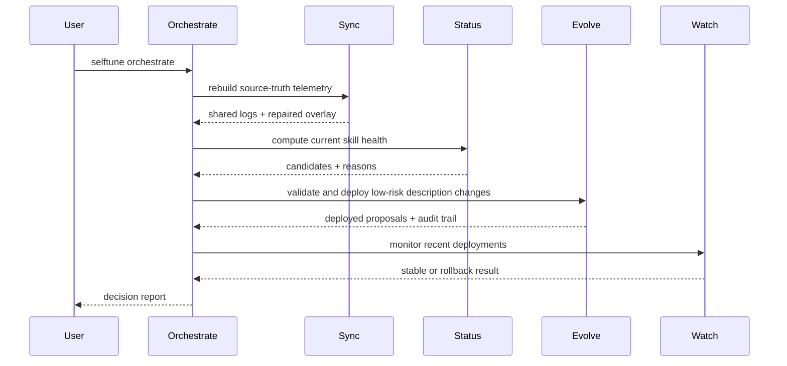
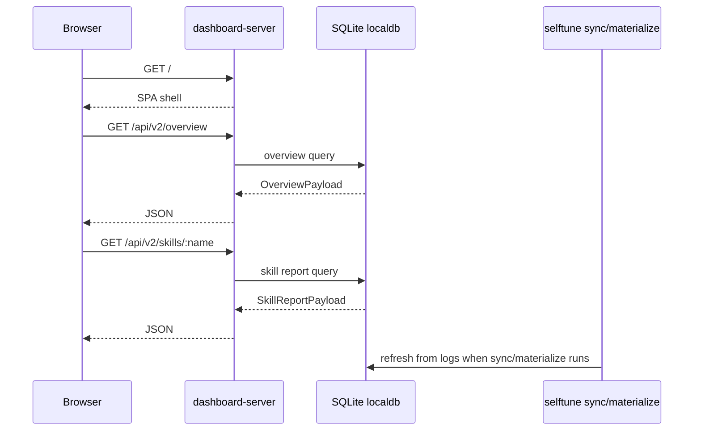

<!-- Verified: 2026-03-15 -->

# System Overview

This is the fastest way to understand how selftune works today.

## In One Sentence

selftune observes agent work from local transcripts and telemetry, rebuilds a trustworthy local record with `sync`, decides whether a skill needs help, deploys validated low-risk description fixes, watches for regressions, and exposes the loop through a local dashboard SPA.

## The Mental Model

selftune has four layers:

1. **Capture** — transcripts, rollouts, session stores, and hooks produce raw evidence.
2. **Normalize** — `selftune sync` rebuilds shared JSONL logs and repaired overlays.
3. **Decide and act** — grading, evolution, orchestrate, watch, and rollback use that evidence.
4. **Surface** — `status`, `last`, and the local SPA explain what the system knows and did.

## End-to-End System

## What Is Authoritative?

Hooks are useful, but they are not the main source of truth.

### Practical rule

- Trust `selftune sync` before trusting `status`, `dashboard`, `watch`, or `orchestrate`.
- Treat hooks as convenience signal for Claude Code, not the canonical record for autonomous changes.

## What Happens During `selftune orchestrate`

### Current autonomy posture

- Low-risk description evolution is autonomous by default.
- Validation is mandatory before deploy.
- Watch and rollback are the safety system after deploy.
- Review-required mode is optional policy, not the main product identity.

## What Happens When You Open The Dashboard

## The Main Local Artifacts

| Artifact | Role |
|---|---|
| `~/.claude/*.jsonl` | Shared append-only logs for telemetry, queries, repaired usage, and evolution audit |
| `selftune sync` | Rebuilds trustworthy local evidence from source systems |
| `cli/selftune/localdb/` | Materializes logs into SQLite tables and payload-oriented queries |
| `cli/selftune/dashboard-server.ts` | Serves the SPA and the v2 dashboard API |
| `apps/local-dashboard/` | Overview and per-skill report UI |

## What selftune Is Not

- Not a hooks-only product
- Not a generic LLM tracing dashboard
- Not a cloud-first dependency for the core loop
- Not a human approval queue for routine low-risk description fixes

## Read Next

- [ARCHITECTURE.md](../../ARCHITECTURE.md) for module boundaries and dependency rules
- [PRD.md](../../PRD.md) for product intent and success metrics
- [docs/integration-guide.md](../integration-guide.md) for setup paths
