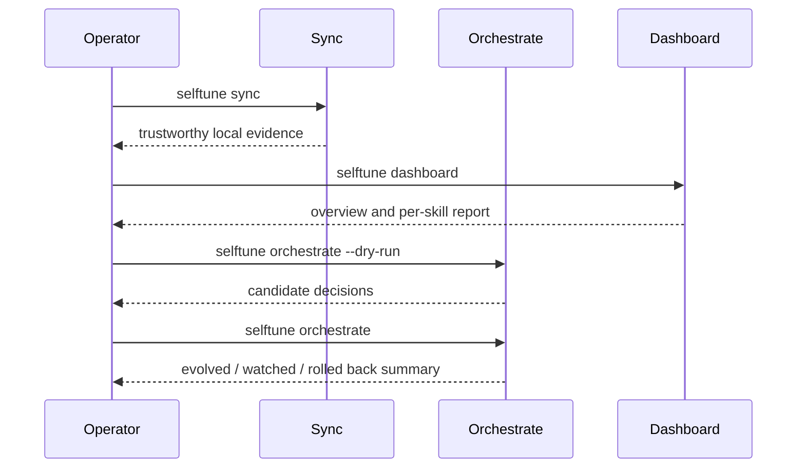

<!-- Verified: 2026-03-15 -->

# Operator Guide

This is the practical runbook for running selftune locally with the current
autonomy-first architecture.

## What This Guide Covers

- first-run verification
- the normal operating loop
- scheduler installation
- the important local files
- dashboard and SQLite checks
- recovery steps when autonomy or local state looks wrong

## Operating Model



## Day 0: First-Run Verification

Run this exact sequence:

```bash
selftune init
selftune doctor
selftune sync
selftune status
selftune dashboard --no-open
```

What you should see:

- `init` writes `~/.selftune/config.json`
- `doctor` reports a healthy install or gives actionable failures
- `sync` rebuilds source-truth local evidence
- `status` shows skills, unmatched queries, and current health
- `dashboard` starts the local server without requiring the old HTML runtime

If you want the autonomous path immediately:

```bash
selftune init --enable-autonomy
selftune orchestrate --dry-run
```

## Day 2: Normal Operating Loop

### 1. Refresh local evidence

```bash
selftune sync
```

Use `--force` only when you explicitly want to rebuild local state from
scratch.

### 2. Inspect health

```bash
selftune status
selftune dashboard
```

Use the CLI for quick health and the dashboard for overview plus per-skill
inspection.

### 3. Preview autonomous action

```bash
selftune orchestrate --dry-run
```

This is the fastest trust check. It should explain:

- which skills were considered
- which were skipped
- which were selected
- which actions would run next

### 4. Run the loop

```bash
selftune orchestrate
```

Current policy:

- low-risk description evolution is autonomous by default
- validation runs before deploy
- watch and rollback are the safety system after deploy
- `--review-required` is an opt-in stricter mode

## Installing Recurring Automation

The main automation path is generic scheduling, not the OpenClaw cron adapter.

Preview the platform-native install plan first:

```bash
selftune schedule --install --dry-run
```

Then install:

```bash
selftune schedule --install
```

Or install during bootstrap:

```bash
selftune init --enable-autonomy
```

### What gets scheduled

| Job | Purpose |
| --- | --- |
| `selftune sync` | refresh source-truth telemetry |
| `selftune sync && selftune status` | refresh local health readout |
| `selftune orchestrate --max-skills 3` | run the autonomous improvement loop |

### Artifact locations

| Format | Location |
| --- | --- |
| cron | `~/.selftune/schedule/selftune.crontab` |
| launchd | `~/Library/LaunchAgents/com.selftune.*.plist` |
| systemd | `~/.config/systemd/user/selftune-*.timer` and `.service` |

### OpenClaw-specific scheduling

Use `selftune cron setup` only when you explicitly want the OpenClaw adapter.
It is still supported, but it is not the primary product path.

## Important Local State

| Path | Meaning |
| --- | --- |
| `~/.selftune/config.json` | detected agent identity and bootstrap config |
| `~/.selftune/selftune.db` | SQLite materialized cache for the local dashboard |
| `~/.claude/session_telemetry_log.jsonl` | session-level telemetry |
| `~/.claude/all_queries_log.jsonl` | all observed user queries |
| `~/.claude/skill_usage_repaired.jsonl` | repaired/source-truth skill usage |
| `~/.claude/evolution_audit_log.jsonl` | proposal, deploy, and rollback audit trail |

## Dashboard Checks

### Start the server

```bash
selftune dashboard --port 3141 --no-open
```

Then open `http://127.0.0.1:3141`.

### What “healthy” means now

- `/` serves the SPA shell
- `/api/v2/overview` returns overview data
- `/api/v2/skills/:name` returns a per-skill report
- the server can rebuild SQLite-backed data from local logs

### If the dashboard looks wrong

1. Run `selftune sync`
2. Restart `selftune dashboard`
3. If needed, remove `~/.selftune/selftune.db` and run `selftune dashboard` again

The SQLite DB is a disposable cache. The logs are still authoritative.

## Recovery Playbook

### Case: `status` or dashboard looks stale

```bash
selftune sync --force
selftune status
```

If the problem is only the SPA view, rebuild the DB cache by deleting
`~/.selftune/selftune.db`.

### Case: scheduler install failed

```bash
selftune schedule --install --dry-run
```

Check the generated artifact path and the activation command. On cron systems,
selftune merges a managed block into the existing crontab instead of replacing
the whole user crontab.

### Case: autonomy chose the wrong skill

Run:

```bash
selftune orchestrate --dry-run
```

Then inspect:

- recent `status` output
- the affected skill’s dashboard report
- `~/.claude/evolution_audit_log.jsonl`

If a deployed change regressed, `watch` and rollback are the first safety
mechanism. The next step is improving candidate selection, not adding more
manual approvals.

## Release-Proof Checklist

Before trusting a published build, verify:

```bash
npx selftune@latest doctor
npx selftune@latest sync
npx selftune@latest status
npx selftune@latest dashboard --no-open
npx selftune@latest orchestrate --dry-run
```

That gives you proof of:

- install health
- source-truth sync
- local observability
- dashboard runtime
- autonomous decision reporting

## Read Next

- [System Overview](design-docs/system-overview.md)
- [Architecture](../ARCHITECTURE.md)
- [Integration Guide](integration-guide.md)
