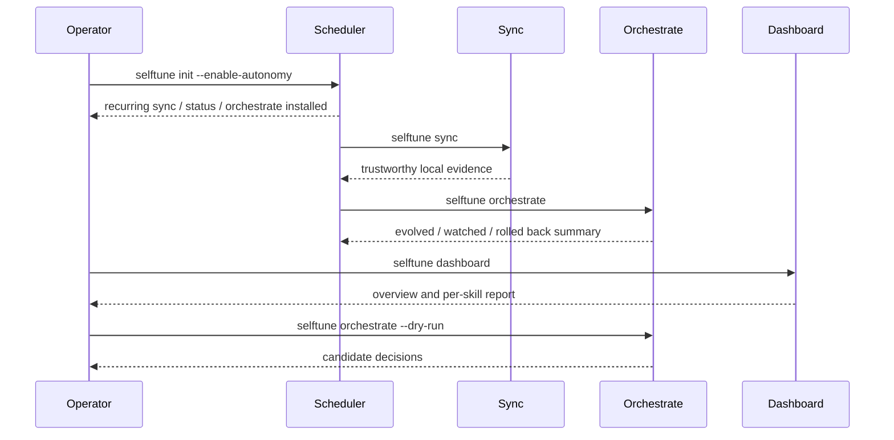

<!-- Verified: 2026-03-15 -->

# Operator Guide

This is the practical runbook for running selftune locally with the current
autonomy-first architecture.

## What This Guide Covers

- the recommended autonomy-first setup path
- first-run verification
- the autonomous operating loop
- scheduler installation
- the important local files
- dashboard and SQLite checks
- recovery steps when autonomy or local state looks wrong

## Operating Model



## Recommended Default: Turn On Autonomy

For most users, the intended path is:

```bash
selftune init --enable-autonomy
selftune dashboard --no-open
selftune orchestrate --dry-run
```

What this means:

- `init --enable-autonomy` installs the recurring scheduler path
- the scheduler handles the background `sync` / `status` / `orchestrate` loop
- `dashboard` is the inspection surface
- `orchestrate --dry-run` is the trust check when you want to see what would happen next

selftune is supposed to be autonomous in the sense that low-risk description
improvements can run on a schedule without manual approval. It is **not** a
long-running daemon yet, and it is still explicitly local-first, so scheduler
installation is how autonomy is activated.

## Manual Verification Path

Use this path when you are:

- verifying a fresh install
- debugging a polluted or stale local state
- rebuilding evidence after imports or replay

Run this exact sequence:

```bash
selftune init
selftune doctor
selftune sync
selftune status
selftune dashboard --no-open
```

What you should see:

- `init` writes `~/.selftune/config.json`
- `doctor` reports a healthy install or gives actionable failures
- `sync` rebuilds source-truth local evidence
- `status` shows skills, unmatched queries, and current health
- `dashboard` starts the local server without requiring the old HTML runtime

If you want the autonomous path immediately:

```bash
selftune init --enable-autonomy
selftune orchestrate --dry-run
```

## Day 2: Autonomous Operating Loop

Once autonomy is enabled, the normal posture is:

- let the scheduler run `sync`, `status`, and `orchestrate`
- use the dashboard to inspect what changed
- use `orchestrate --dry-run` when you want a visible decision preview

Most operators should **not** be manually running `sync` as a daily ritual.
`sync` matters because it is the authoritative evidence builder, but it should
usually happen via the scheduler or as the first step inside `orchestrate`.

### 1. Refresh local evidence

```bash
selftune sync
```

Use `--force` only when you explicitly want to rescan all source-truth inputs.
It is not a substitute for the export-first DB recovery path.

When autonomy is already installed, treat this as a repair/verification command,
not the main product interaction.

If you hit a SQLite/schema failure, do this instead of looking for a nonexistent
`rebuild-db` command:

```bash
selftune export
rm ~/.selftune/selftune.db
selftune sync --force
```

Export first so recent SQLite-backed rows are preserved before recreating the DB.

### 2. Inspect health

```bash
selftune status
selftune dashboard
```

Use the CLI for quick health and the dashboard for overview plus per-skill
inspection.

### 3. Preview autonomous action

```bash
selftune orchestrate --dry-run
```

This is the fastest trust check. It should explain:

- which skills were considered
- which were skipped
- which were selected
- which actions would run next

### 4. Run the loop

```bash
selftune orchestrate
```

Current policy:

- low-risk description evolution is autonomous by default
- validation runs before deploy
- watch and rollback are the safety system after deploy
- `--review-required` is an opt-in stricter mode

## Installing Recurring Automation

The main automation path is generic scheduling, not the OpenClaw cron adapter.

Preview the platform-native install plan first:

```bash
selftune schedule --install --dry-run
```

Then install:

```bash
selftune schedule --install
```

Or install during bootstrap:

```bash
selftune init --enable-autonomy
```

### What gets scheduled

| Job                                   | Purpose                             |
| ------------------------------------- | ----------------------------------- |
| `selftune sync`                       | refresh source-truth telemetry      |
| `selftune sync && selftune status`    | refresh local health readout        |
| `selftune orchestrate --max-skills 3` | run the autonomous improvement loop |

### Artifact locations

| Format  | Location                                                 |
| ------- | -------------------------------------------------------- |
| cron    | `~/.selftune/schedule/selftune.crontab`                  |
| launchd | `~/Library/LaunchAgents/com.selftune.*.plist`            |
| systemd | `~/.config/systemd/user/selftune-*.timer` and `.service` |

### OpenClaw-specific scheduling

Use `selftune cron setup` only when you explicitly want the OpenClaw adapter.
It is still supported, but it is not the primary product path.

## Important Local State

| Path                                    | Meaning                                                              |
| --------------------------------------- | -------------------------------------------------------------------- |
| `~/.selftune/config.json`               | detected agent identity and bootstrap config                         |
| `~/.selftune/selftune.db`               | SQLite operational database (direct-write + materialized from JSONL) |
| `~/.claude/session_telemetry_log.jsonl` | session-level telemetry                                              |
| `~/.claude/all_queries_log.jsonl`       | all observed user queries                                            |
| `~/.claude/skill_usage_repaired.jsonl`  | repaired/source-truth skill usage                                    |
| `~/.claude/evolution_audit_log.jsonl`   | proposal, deploy, and rollback audit trail                           |
| `~/.claude/orchestrate_runs.jsonl`      | persisted orchestrate run reports and skill-level actions            |

## Dashboard Checks

### Start the server

```bash
selftune dashboard --port 3141 --no-open
```

Then open `http://127.0.0.1:3141`.

### What “healthy” means now

- `/` serves the SPA shell
- `/api/v2/overview` returns overview data
- `/api/v2/skills/:name` returns a per-skill report
- `/api/v2/orchestrate-runs` returns recent orchestrate activity
- the server uses SQLite as the operational database, with JSONL as the audit trail

### If the dashboard looks wrong

1. Run `selftune sync`
2. Restart `selftune dashboard`
3. If needed, remove `~/.selftune/selftune.db` and run `selftune dashboard` again

SQLite is the operational database. JSONL is the audit trail. The materializer rebuilds SQLite from JSONL for recovery or migration. Direct-write hooks keep SQLite current in real-time.

## Recovery Playbook

### Case: `status` or dashboard looks stale

```bash
selftune sync --force
selftune status
```

If the problem is only the SPA view, rebuild the DB by deleting
`~/.selftune/selftune.db` (the materializer will rebuild it from JSONL on next startup).

### Case: scheduler install failed

```bash
selftune schedule --install --dry-run
```

Check the generated artifact path and the activation command. On cron systems,
selftune merges a managed block into the existing crontab instead of replacing
the whole user crontab.

### Case: autonomy chose the wrong skill

Run:

```bash
selftune orchestrate --dry-run
```

Then inspect:

- recent `status` output
- recent orchestrate runs in the dashboard overview
- the affected skill’s dashboard report
- `~/.claude/orchestrate_runs.jsonl`
- `~/.claude/evolution_audit_log.jsonl`

If a deployed change regressed, `watch` and rollback are the first safety
mechanism. The next step is improving candidate selection, not adding more
manual approvals.

## Release-Proof Checklist

Before trusting a published build, verify:

```bash
npx selftune@latest doctor
npx selftune@latest sync
npx selftune@latest status
npx selftune@latest dashboard --no-open
npx selftune@latest orchestrate --dry-run
```

That gives you proof of:

- install health
- source-truth sync
- local observability
- dashboard runtime
- autonomous decision reporting

## Read Next

- [System Overview](design-docs/system-overview.md)
- [Architecture](../ARCHITECTURE.md)
- [Integration Guide](integration-guide.md)
